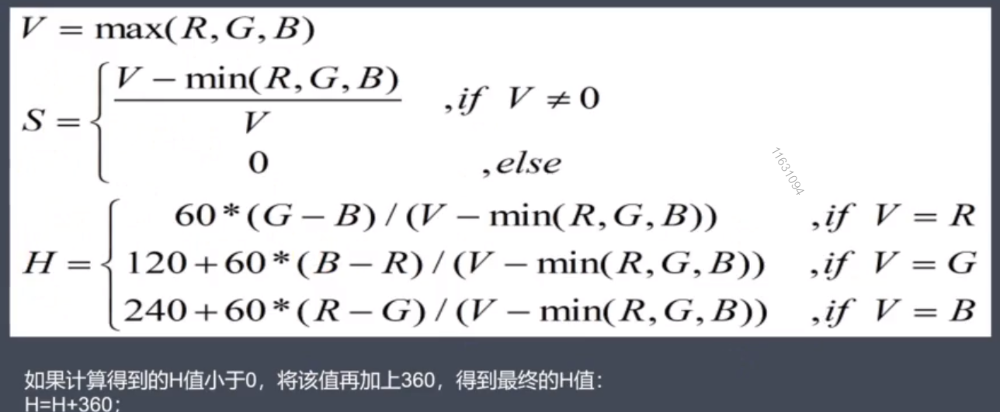

# First

## webgl 外部变量

| 变量输入     | 变量输入意义 |
| ------------ | ------------ |
| u_resolution | 画布的长和宽 |
| u time       | 系统时间     |
| u_mouse      | 系统鼠标位置 |
| texture      | 纹理         |

## 设定方式

## 颜色转换（RGB、HSB）

将 RGB 0-255 转换（直接除255）至 0-1 间，可便于 GPU 进行浮点计算

HSV/B：
H [0, 360] 色相、角度值
S [0, 1] 饱和度
V/B [0, 1] 亮度



```glsl
//rgb转hsv
vec3 rgb2hsv(vec3 c) {
  vec4 K = vec4(0.0, -1.0/3.0, 2.0/3.0, -1.0);
  vec4 p = mix(vec4(c.bg, K.wz), vec4(c.gb, K.xy), step(c.b, c.g));
  vec4 q = mix(vec4(p.xyw, c.r), vec(c.r, p.yzx), step(p.x, c.r));

  float d = q.x - min(q.w, q.y);
  float e = 1.0e-10;

  return vec3(abs(q.z + (q.w - q.y)/(6.0 * d + e)), d /(q.x + e), q.x);
}

//hsv转rgb
vec3 hsv2rgb(vec3 c) {
  vec4 K = vec4(1.0,2.0 /3.0,1.0 /3.0,3.0);
  vec3 p = abs(fract(c.xxx + Kxyz)* 6.0 - Kwww);
  return c.z * mix(K.xxx, clamp(p-K.xxx, 0.0, 1.0), c.y);
}
```

## 常用函数

### abs()

```glsl
  float abs(float x);

  vec2 abs(vec2 x);

  vec3 abs(vec3 x);

  vec4 abs(vec4 x);
```


### sign()

```glsl
  float sign(float x);

  vec2 sign(vec2 x);

  vec3 sign(vec3 x);

  vec4 sign(vec4 x);
```


### ceil()

> 向上取整

```glsl
  float ceil(float x);

  vec2 ceil(vec2 x);

  vec3 ceil(vec3 x);

  vec4 ceil(vec4 x);
```


