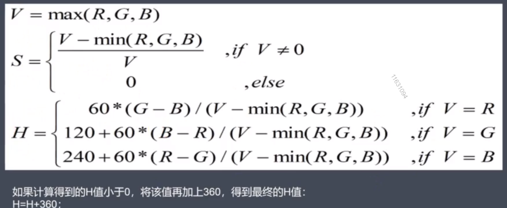

# 颜色转换（RGB、HSB）

将 RGB 0-255 转换（直接除255）至 0-1 间，可便于 GPU 进行浮点计算

HSV/B：
H [0, 360] 色相、角度值
S [0, 1] 饱和度
V/B [0, 1] 亮度



```glsl
#ifdef GL_ES
precision mediump float;
#endif

uniform vec2 u_resolution;
uniform float u_time;

vec3 rgb2hsb( in vec3 c ){
    vec4 K = vec4(0.0, -1.0 / 3.0, 2.0 / 3.0, -1.0);
    vec4 p = mix(vec4(c.bg, K.wz),
                 vec4(c.gb, K.xy),
                 step(c.b, c.g));
    vec4 q = mix(vec4(p.xyw, c.r),
                 vec4(c.r, p.yzx),
                 step(p.x, c.r));
    float d = q.x - min(q.w, q.y);
    float e = 1.0e-10;
    return vec3(abs(q.z + (q.w - q.y) / (6.0 * d + e)),
                d / (q.x + e),
                q.x);
}

//  Function from Iñigo Quiles
//  https://www.shadertoy.com/view/MsS3Wc
vec3 hsb2rgb( in vec3 c ){
    vec3 rgb = clamp(abs(mod(c.x*6.0+vec3(0.0,4.0,2.0),
                             6.0)-3.0)-1.0,
                     0.0,
                     1.0 );
    rgb = rgb*rgb*(3.0-2.0*rgb);
    return c.z * mix(vec3(1.0), rgb, c.y);
}

void main(){
    vec2 st = gl_FragCoord.xy/u_resolution;
    vec3 color = vec3(0.0);

    // We map x (0.0 - 1.0) to the hue (0.0 - 1.0)
    // And the y (0.0 - 1.0) to the brightness
    color = hsb2rgb(vec3(st.x,1.0,st.y));

    gl_FragColor = vec4(color,1.0);
}
```
