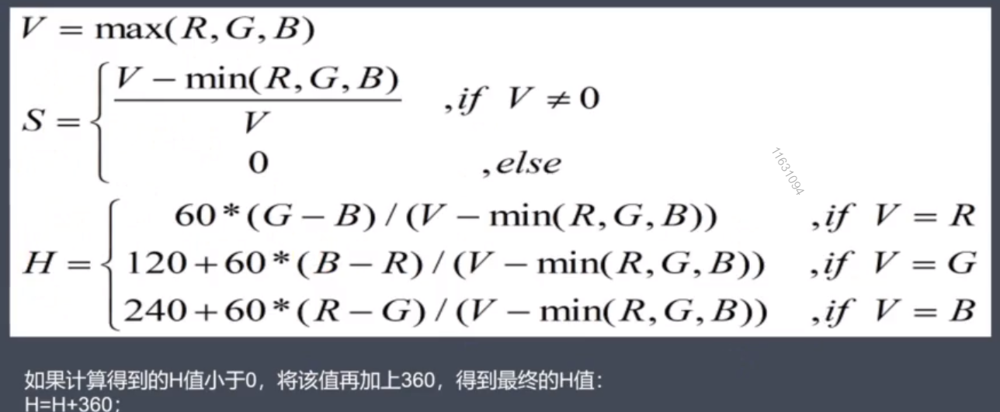
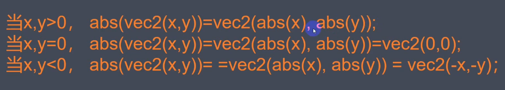
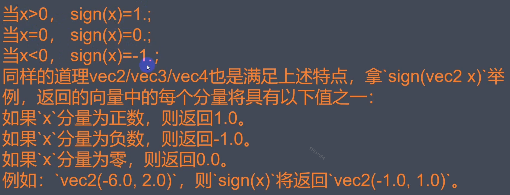
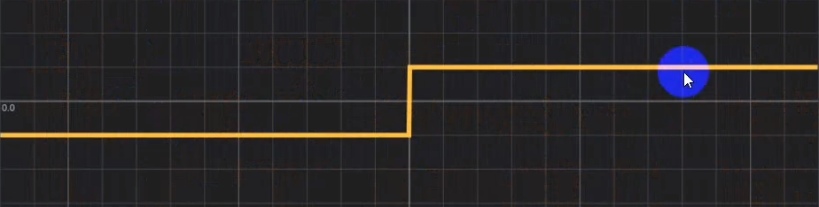
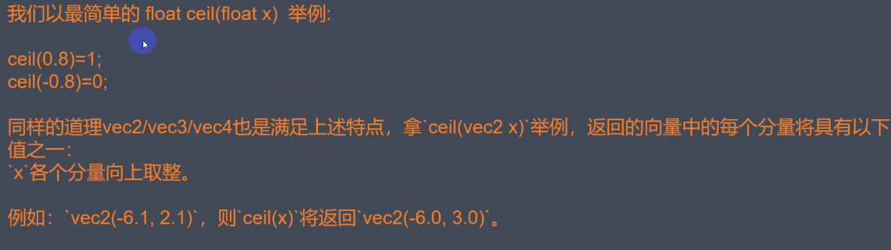
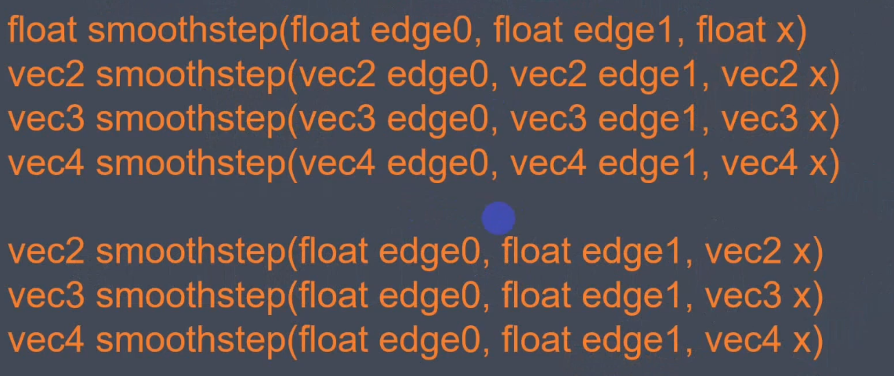
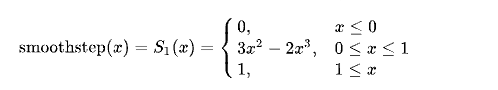
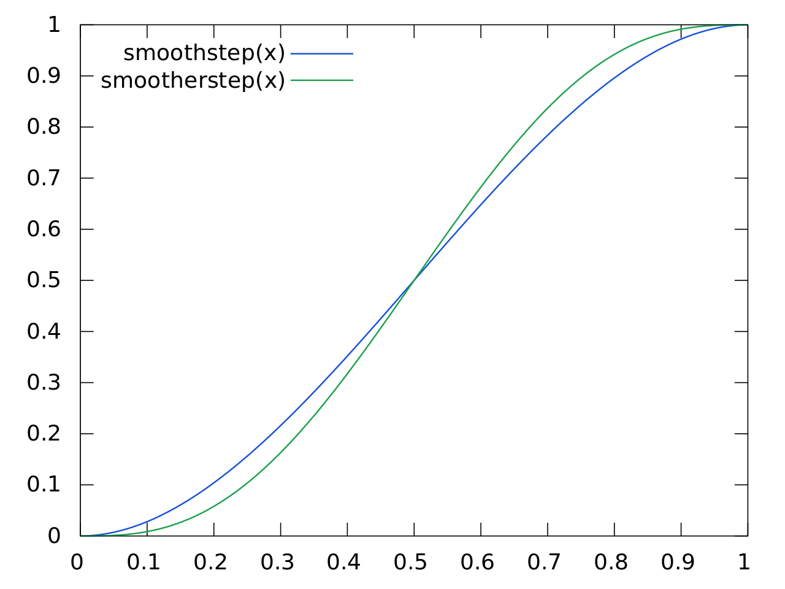
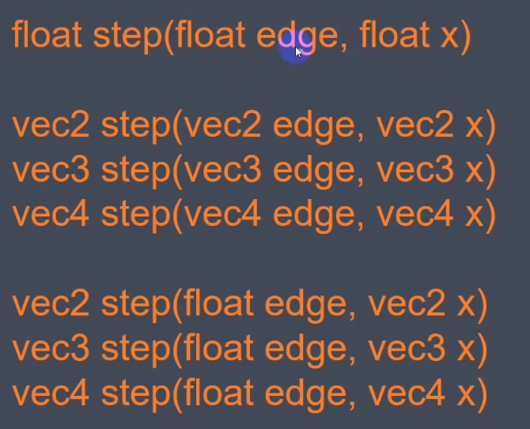
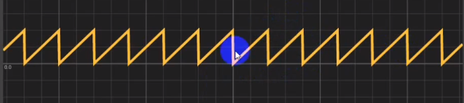

# First

## webgl 外部变量

| 变量输入     | 变量输入意义 |
| ------------ | ------------ |
| u_resolution | 画布的长和宽 |
| u time       | 系统时间     |
| u_mouse      | 系统鼠标位置 |
| texture      | 纹理         |

## 设定方式

## gl\_

### gl_FragCoord

gl_FragCoord 是在片段着色器（Fragment Shader）中的一个内建变量，它表示当前片段（像素）在屏幕空间中的坐标。具体来说，它是一个包含四个分量的浮点向量：

gl_FragCoord.x 表示片段的 x 坐标。
gl_FragCoord.y 表示片段的 y 坐标。
gl_FragCoord.z 表示片段的深度值（在透视投影中有意义）。
gl_FragCoord.w 表示片段的透视除法的分母值。

这个变量的坐标系统是以屏幕左下角为原点，x 轴向右，y 轴向上。在片段着色器中，你可以使用 gl_FragCoord 来获取当前像素的屏幕坐标，从而执行一些与屏幕位置相关的计算，比如纹理坐标的计算、光照等。

## 颜色转换（RGB、HSB）

将 RGB 0-255 转换（直接除255）至 0-1 间，可便于 GPU 进行浮点计算

HSV/B：
H [0, 360] 色相、角度值
S [0, 1] 饱和度
V/B [0, 1] 亮度



```glsl
//rgb转hsv
vec3 rgb2hsv(vec3 c) {
  vec4 K = vec4(0.0, -1.0/3.0, 2.0/3.0, -1.0);
  vec4 p = mix(vec4(c.bg, K.wz), vec4(c.gb, K.xy), step(c.b, c.g));
  vec4 q = mix(vec4(p.xyw, c.r), vec(c.r, p.yzx), step(p.x, c.r));

  float d = q.x - min(q.w, q.y);
  float e = 1.0e-10;

  return vec3(abs(q.z + (q.w - q.y)/(6.0 * d + e)), d /(q.x + e), q.x);
}

//hsv转rgb
vec3 hsv2rgb(vec3 c) {
  vec4 K = vec4(1.0,2.0 /3.0,1.0 /3.0,3.0);
  vec3 p = abs(fract(c.xxx + Kxyz)* 6.0 - Kwww);
  return c.z * mix(K.xxx, clamp(p-K.xxx, 0.0, 1.0), c.y);
}
```

## 常用函数

### abs()

```glsl
  float abs(float x);

  vec2 abs(vec2 x);

  vec3 abs(vec3 x);

  vec4 abs(vec4 x);
```



### sign()

```glsl
  float sign(float x);

  vec2 sign(vec2 x);

  vec3 sign(vec3 x);

  vec4 sign(vec4 x);
```





### ceil/floor()

> 向上/下取整

```glsl
  float ceil/floor(float x);

  vec2 ceil/floor(vec2 x);

  vec3 ceil/floor(vec3 x);

  vec4 ceil/floor(vec4 x);
```



### smoothstep

> 平滑阶跃函数



如果 edge0 > edge 1，则从 1-0 的阶跃
如果 edge0 < edge 1，则从 0-1 的阶跃

#### 函数定义



#### 函数图像



### step



```glsl
step(1.0, x) // x < 1 return 0; x > 1 return 1
```

### mod——求余

#### 语法

```glsl
  float mod(float x, float y);
  vec2 mod(vec2 x, vec2 y);
  vec3 mod(vec3 x, vec3 y);
  vec4 mod(vec4 x, vec4 y);

  vec2 mod(vec2 x, float y);
  vec3 mod(vec3 x, float y);
  vec4 mod(vec4 x, float y);
```

#### 函数图像



### mix

```
T mix(T x, T y, float a);
```

这里，T 是要进行插值的值的类型，可以是 float、vec2、vec3、vec4 等。参数 x 和 y 是要进行插值的两个值，而参数 a 是插值的权重，通常在 0.0 到 1.0 之间。

函数的计算方式为：

```
result = x * (1.0 - a) + y * a;
```
